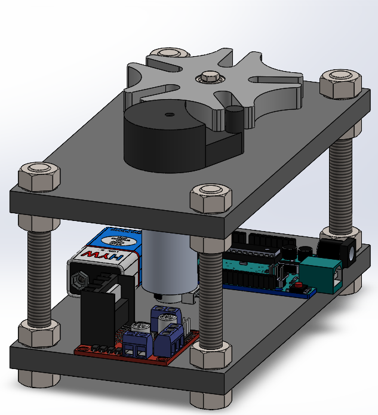
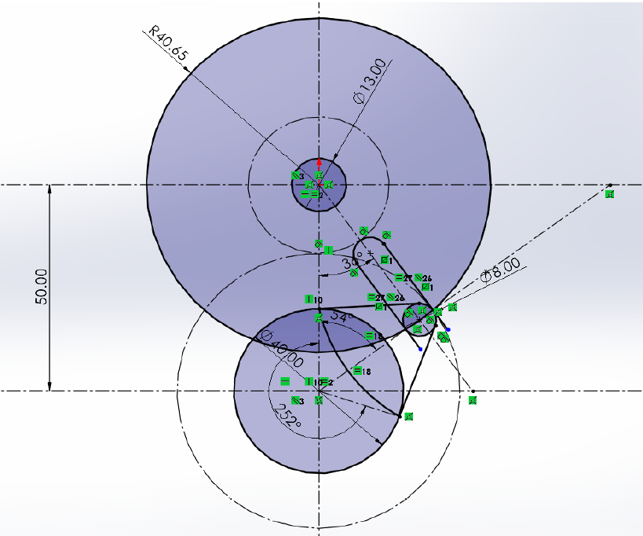

# Geneva Mechanism

  

## Abstract
This project presents the 3D design, assembly, and motion simulation of a five-slot Geneva mechanism using SolidWorks. The mechanism converts continuous rotary motion into intermittent motion, providing 72° indexing per cycle followed by a dwell period. The project includes detailed component modeling, assembly, and motion simulation to verify the mechanism's operation. Motion, torque, force, and stress analyses were also performed to evaluate the mechanical performance and structural integrity of the design.

---

## Mechanical System
The Geneva mechanism consists of the following main components:
**Driving Wheel:** Provides continuous rotary motion and carries the driving pin.
**Geneva Wheel:** Converts the continuous input motion into intermittent rotary motion.
**Driving Pin:** Engages with the Geneva wheel slots and transfers motion.
**Locking Disc:** Prevents unwanted rotation of the Geneva wheel during the dwell period.
**Shafts:** Support and transmit rotational motion between the components.
**Bearings:** Support the shafts and reduce friction during rotation.
**Base/Frame:** Supports and maintains the alignment of the mechanism components.

  

## Electrical System
- Arduino UNO
- L298N Motor Driver 
- DC  Motors
- Battery

## Demonstration Video

  

    
  

